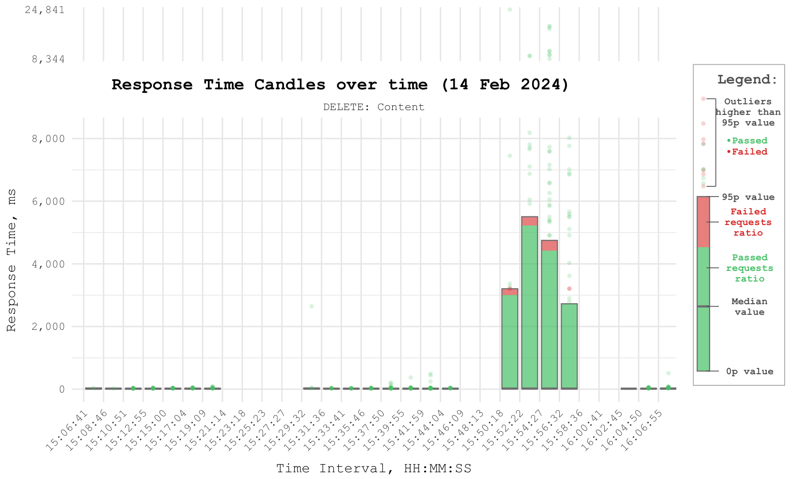
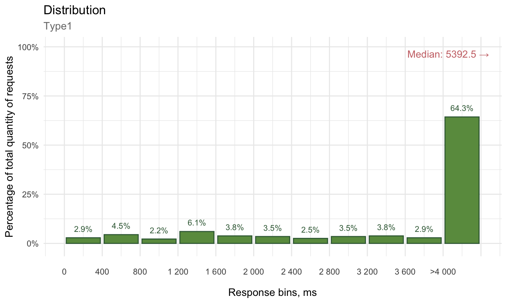
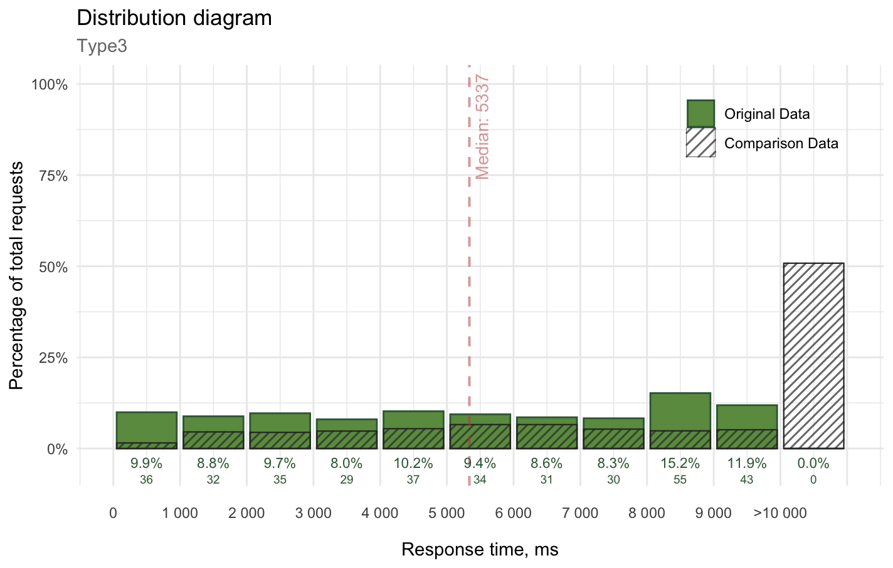

# confint visualisations package

## and_candles_for_all.R

Builds candles which reflect percentiles, outliers and pass/fail ratio.

#### Example



#### Data

Input the file with the following columns:

```         
timeStamp,elapsed,label,success
2024/02/19 14:07:28.070,1605,Login,TRUE
2024/02/19 14:08:28.070,1034,GetTime,TRUE
2024/02/19 14:09:28.070,93,Logout,FALSE
```

...the columns can have different names. But you have to specify them in your code then.

...or use built-in data generation.

#### Idea

This one is enhance boxplot with whiskers chart to produce more accessible visualisation of changing response time.

Splits the entire input time interval to the defined quantity of candles and visualises data as the candle of:

-   defined lower percentile (`default: min value or 0p`)

-   defined higher percentile (`default: 95p`)

-   ratio of passed and failed requests during each interval (success = TRUE / FALSE)

-   all outliers higher than higher percentile

    -   main chart contains all the data within multiplier of max of observed 95p value (`default: 1.5`)

    -   additional squeezed chart contains all the data above main chart

    -   outliers are colorized in the same way as success = TRUE / FALSE

-   Legend is added.

#### Usage

Call `generate_candles_chart(your_data, name_of_your_label)`.

#### Settings

Use `####CHART SETTINGS####`

------------------------------------------------------------------------

## distributions.R

Builds distributions which reflects

#### Examples

 

#### Data

Input the file with the following columns:

```         
response,group
1605,Login
1034,GetTime
93,Logout
```

Or use built-in data generation.

#### Idea

This is a slightly enhanced distribution diagram.

The idea is to drill-down onto intervals everything that is lying inside the limit (potentially: specified SLA) and then everything that is higher than this limit.

Comparison of such distributions was always the trickiest thing: putting one semi-transparent layer over other makes it hard to distinguish what is what. So for the comparison a pattern-applied bars are quite suitable for this goal, however not available in all the tools.

As an addition, the statistics for median value are added (which can be for sure changed to any other statistics, like 95 percentile) and handled when median is out of bound of the main chart.

#### Usage

For single distribution: `distrib_single(data_original, your_request_type_to_filter, your_sla))`.

For comparison distribution: `distrib_single(data_original, data_original_name_for_legend, data_comparison, data_comparison_name_for_legend, your_request_type_to_filter, your_sla))`.

#### Settings

Use `####CHART SETTINGS####`
